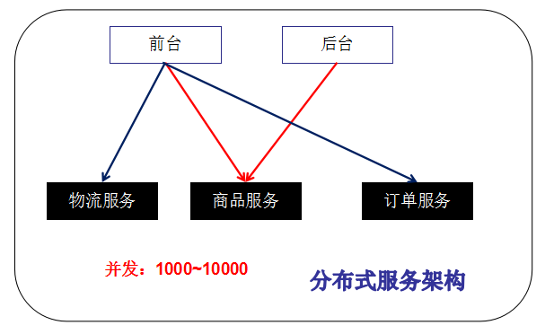

# [Dubbo](https://dubbo.apache.org/zh/index.html)

# 1. Dubbo概述

## 1.1 什么是分布式

* 《分布式系统原理与范型》定义：
    * “分布式系统是若干独立计算机的集合，这些计算机对于用户来说就像单个相关系统”
    * 分布式系统是建立在网络上之的软件系统。

### 1.1.1 单一应用架构


### 1.1.2 垂直应用架构


### 1.1.3 分布式服务框架



独立服务器之间依靠**RPC（Remote Procedure Call，远程过程调用）**。

### 1.1.4 流动计算架构


* 提高机器利用率的资源调度中心（SOA）是关键
* SOA（Service-Orient Architecture面向服务架构），服务治理

## 1.2 Dubbo简介

* Dubbo是分布式服务框架

### 1.2.1 RPC

* RPC是一种进程间通信方式
* 基本的通信原理
  
* RPC两个核心模块：通讯（socket）和序列化

### 1.2.1 节点角色

| 节点        | 角色说明               |
|-----------|--------------------|
| Provider  | 暴露服务的服务方           |
| Consumer  | 调用远程服务的消费方         |
| Registry  | 服务注册与发现的注册中心       |
| Monitor   | 统计服务调用次数和调用时间的监控中心 |
| Container | 服务器运行容器            |

Dubbo架构


# 2. 快速入门

## 2.1 注册中心

### 2.1.1 Zookeeper

###

dubbo服务在zookeeper注册时机：首次调用服务引用服务端服务网所在controller

#### NOTES

1. 服务端[HelloServiceImpl.java](./dubbo-server/src/main/java/service/impl/HelloServiceImpl.java)
   注解@Service是Dubbo的@Service不是Spring的，Dubbo3中可以使用@DubboService

# 3. 监控中心

## 3.1 服务端管理（dubbo-admin-master）

### 3.1.1 安装管理器

```
# 修改配置dubbo-admin\src\main\resources\application.properties

  server.port=7001
  dubbo.registry.address=zookeeper://zookeeper服务器ip:2181
  
# 返回dubbo-admin根目录
mvn clean package
# 运行target目录下jar包
java -jar dubbo-admin-0.0.1-SNAPSHOT.jar
# 访问http://localhost:7001，账户密码都是root
```


## 3.2 监控统计中心（dubbo-monitor-simple-2.5.3）

Monitor：统计中心 ，记录服务被调用多少次等

```
# 修改注册中心地址（dubbo-monitor-simple-2.5.3\conf\dubbo.properties）：
# dubbo.registry.address=zookeeper://zookeeper服务器ip:2181
# 访问：http://localhost:8080/
```


# 4. 综合实战

## 4.1 配置说明

用法实例：https://dubbo.apache.org/zh/docsv2.7/user/examples/

### 4.1.1 [启动时检查](https://dubbo.apache.org/zh/docsv2.7/user/examples/preflight-check/)

* 启动时会在注册中心检查依赖服务是否可用，不可用时会抛出异常
* 在消费方编写初始化容器的main方法启动（tomcat启动方式，必须访问一次action才能初始化spring）

```xml
<!--默认是true，抛异常，false：不抛异常-->
<dubbo:consumer check="true"></dubbo:consumer>
```                     

### 4.1.2 超时时间

服务端提供者配置

```xml
<!--    默认1s-->
<dubbo:provider timeout="2000"></dubbo:provider>
```

* 配置原则：
    * dubbo推荐在Provider上尽量多配置Consumer属性：
        1. 作为服务的提供者，比服务使用方更清楚服务性能参数，如调用的超时时间，合理的重试次数。
        2. 在Provider配置后，Consumer不配置则会使用Provider的配置值，即Provider配置可以作为消费者的缺省值。

### 4.1.3 重试次数

* 当出现失败，自动切换并重试其它服务器，dubbo重试的缺省值是2次

```xml

<dubbo:provider retries="3"></dubbo:provider>
```

* 并不是所有的方法都适合设置重试次数
    * 幂等方法：适当（当参数一样，无论执行多少次，结果是一样的，例如：查询，修改）
    * 非幂等方法：不适当（当参数一样，执行结果不一样，查询、添加）
* （客户端）单独设置某个方法

```xml

<dubbo:reference interface="service.HelloService" id="helloService">
    <dubbo:method name="sayHello" retries="3"></dubbo:method>
    <dubbo:method name="sayNo" retries="0"></dubbo:method>
</dubbo:reference>
```

### 4.1.4 多版本

* 一个接口，多个（版本）实现类，可以使用定义版本的方式引入

客户端配置

```xml

<dubbo:reference version="2.0.0">
    <dubbo:method name="sayHello" retries="3"></dubbo:method>
    <dubbo:method name="sayNo" retries="0"></dubbo:method>
</dubbo:reference>
```

服务端配置

```xml

<dubbo:service interface="service.HelloService" class="service.impl.HelloServiceImpl01"
               version="1.0.0"></dubbo:service>
<dubbo:service interface="service.HelloService" class="service.impl.HelloServiceImpl02"
               version="2.0.0"></dubbo:service>
```

### 4.1.5 本地存根（Stub）

```xml

<dubbo:reference interface="service.HelloService" id="helloService" version="2.0.0" stub="stub.HelloServiceStub">
    <dubbo:method name="sayHello" retries="3"></dubbo:method>
    <dubbo:method name="sayNo" retries="0"></dubbo:method>
</dubbo:reference>
```

在 Dubbo
中利用本地存根在客户端执行部分逻辑：[HelloServiceStub.java](./dubbo-consumer/src/main/java/stub/HelloServiceStub.java)

1. Stub 必须有可传入 Proxy 的构造函数。
2. 在 interface 旁边放一个 Stub 实现，它实现 BarService 接口，并有一个传入远程 BarService 实例的构造函数

## 4.2 负载均衡策略

* 负载均衡（Load Balance），其实就是将请求分摊到多个操作单元上进行操作，从而共同完成工作。
* Dubbo 提供4种策略，缺省的为random随机分配调用。
  

修改客户端spring配置文件：

```xml

<dubbo:reference loadbalance="roundrabin" interface="service.HelloService" id="helloService" version="2.0.0"
                 stub="stub.HelloServiceStub">
    <dubbo:method name="sayHello" retries="3"></dubbo:method>
    <dubbo:method name="sayNo" retries="0"></dubbo:method>
</dubbo:reference>
```

通过管理器设置权重：


## 4.3 高可用
### 4.3.1 zookeeper宕机
* zookeeper注册中心宕机，还可以消费dubbo暴露的服务。
  * 注册中心全部宕掉后，服务提供者和消费服务者仍能通过本地缓存通讯。

## 4.4 服务降级
* 服务降级：根据实际情况和流量，对一些服务有策略的停止或者换种简单的方式处理，
从而释放服务的资源来保证核心业务的正常运行。

### 4.4.1 为什么要服务降级
* 防止分布式服务发生**雪崩效应**。

### 4.4.2 服务降级实现方式
1. 管理控制台配置服务降级：屏蔽和容错
   * 屏蔽：mock=force:return+null，表示消费方对该服务的方法调用都直接返回null值，不发起远程调用。
   用来屏蔽不重要的服务不可用时对调用方的影响。
   * 容错：mock=fail:return+null，表示消费方对该服务的方法调用在失败后，再返回null，不抛异常。
   用来容忍不重要服务不稳定时调用方的影响。


# NOTES
## 1. \<packaging\>pom\</packaging\>

\<packaging\>pom\</packaging\>的意思是使用maven分模块管理，都会有一个父级项目，
pom文件一个重要的属性就是packaging（打包类型），一般来说所有的父级项目的packaging都为pom，
packaging默认类型jar类型，如果不做配置，maven会将该项目打成jar包。  
Maven POM POM( Project Object Model,项目对象模型 ) 是 Maven 工程的基本工作单元。

## class lombok.javac.apt.LombokProcessor (in unnamed module @0x53c1179a) cannot access class com.sun.tools.javac.processing.JavacProcessingEnvironment (in module jdk.compiler) because module jdk.compiler does not export com.sun.tools.javac.processing to unnamed module @0x53c1179a

出现这个报错的主要问题是 Lombok 的问题，将 Lombok 的版本换为 1.18.20 版本或以上的就可以了

## 连接mysql 错误号码1129 

    mysql error 1129: Host 'bio.chip.org' is blocked because of many connection errors; unblock with 'mysqladmin flush-hosts'。

作者：残梦js
链接：https://www.jianshu.com/p/ad9ddfbe3f3d
来源：简书
著作权归作者所有。商业转载请联系作者获得授权，非商业转载请注明出处。


# 解决maven项目打包war时报错:Error injecting constructor
https://blog.csdn.net/lenny_wants/article/details/124088314

pom.xml添加
```xml
<plugin>
 	<groupId>org.apache.maven.plugins</groupId>
    <artifactId>maven-war-plugin</artifactId>
    <version>3.3.2</version>
</plugin>
```